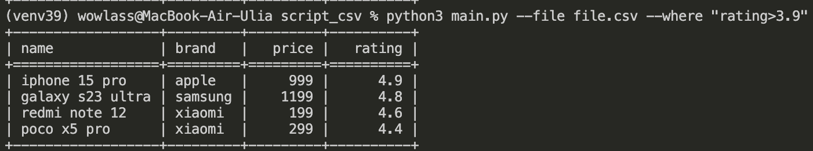
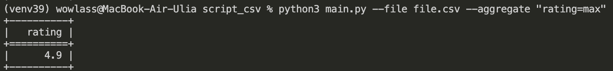
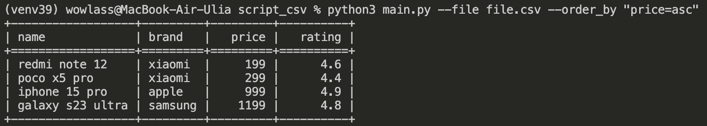
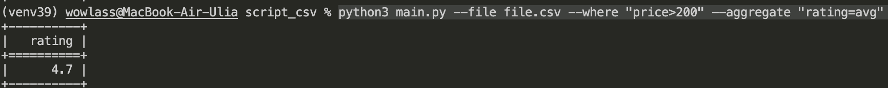

# CSV‑CLI: фильтрация, агрегация и сортировка

Небольшая утилита для работы с CSV-файлами:
- фильтрация по `>`, `<`, `=`
- агрегация `min`, `max`, `avg`
- сортировка `asc`, `desc`

---

## Установка.
1. Клонируйте репозиторий и перейдите в его директорию:

```
git clone git@github.com:AntonNovozhilov/cat_charity_fund.git
```

```
cd csv_script
```

2. Cоздать и активировать виртуальное окружение:

```
python3 -m venv venv
```
* Если у вас Linux/macOS

    ```
    source venv/bin/activate
    ```

* Если у вас windows

    ```
    source venv/scripts/activate
    ```

3. Установить зависимости из файла requirements.txt:

```
pip install -r requirements.txt
```
4. Перейти в раб. директорию.
```
cd script_csv
```
---
## Примеры команд
### Показать содержимое файла
```
python3 main.py --file /Users/wowlass/Dev/csv_skript/asd/file.csv
```
если файл лежит в папке то можно указать просто его название 
```
python3 main.py --file file.csv
```

### Применить фильтр к файлу
```
python3 main.py --file file.csv --where "rating>3.9"
```


### Применить агрегацию 
```
python3 main.py --file file.csv --where --aggregate "rating=max"
```

### Применить сортировку
```
python3 main.py --file file.csv --order_by "price=asc"
```

### Варианты можно комбинировать
```
python3 main.py --file file.csv --where "price>200" --aggregate "rating=avg"
```

